# API

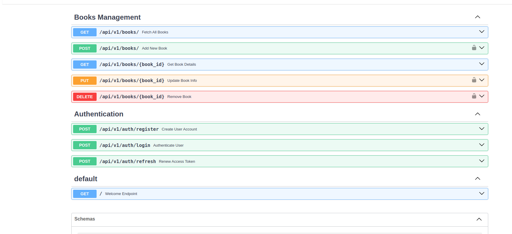

# CREATE USER

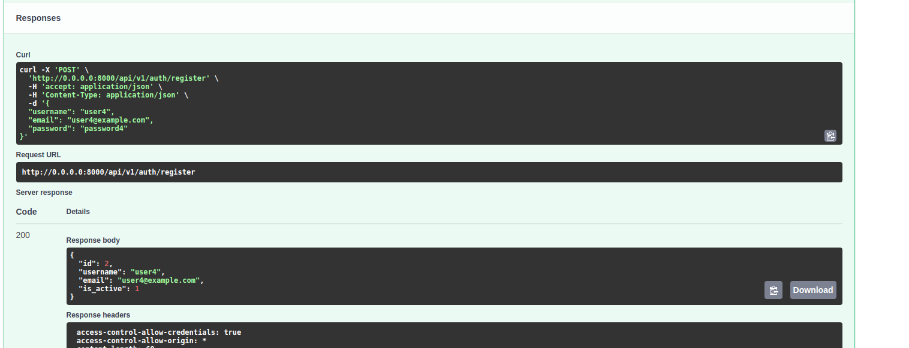

# LOGIN

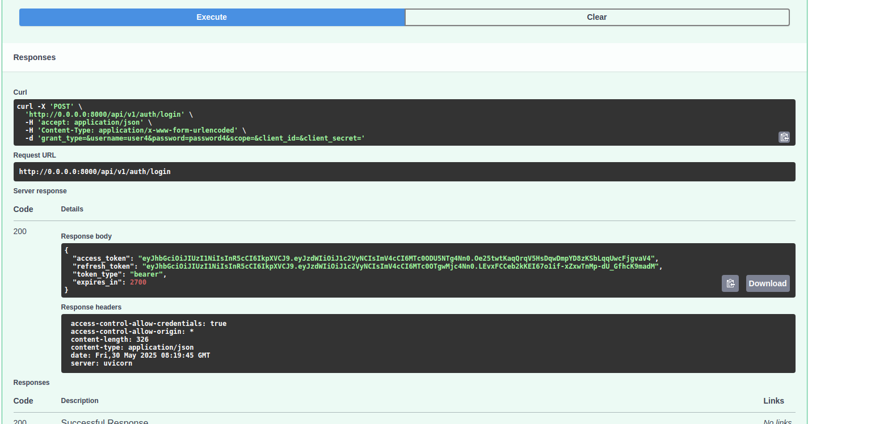

# REFRESH TOKEN

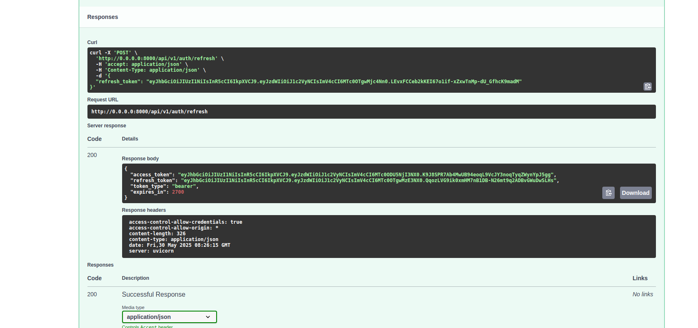

# USER ALREADY EXIST

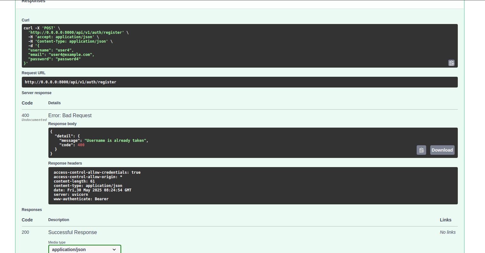

# RATE LIMITER TESTS

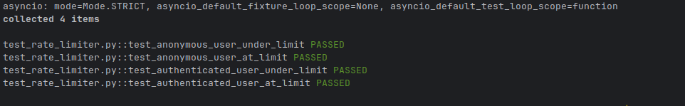

# POST FOR AUTH

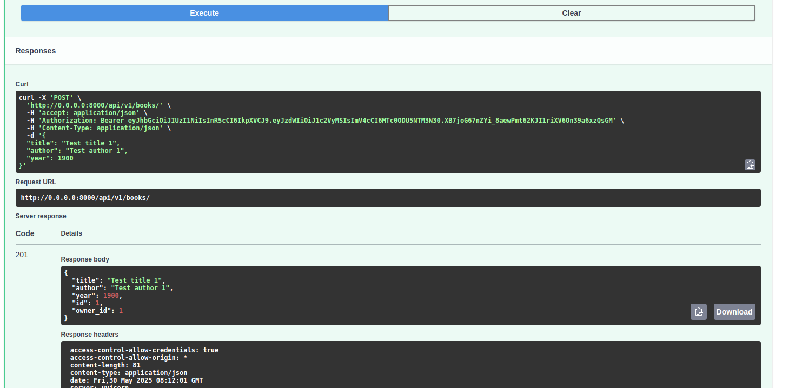

# POST FOR NOT AUTH

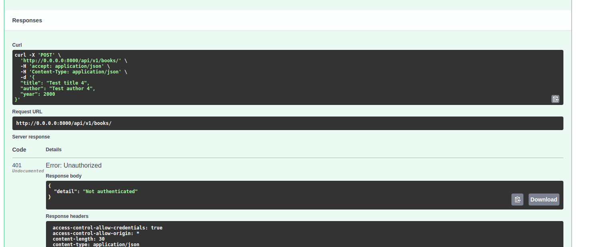

# GET ALL BOOKS

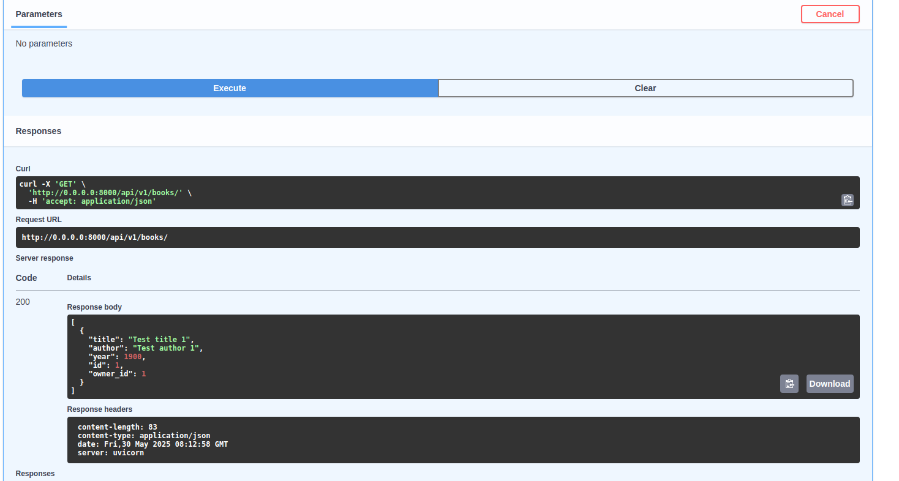

# GET BOOK BY ID

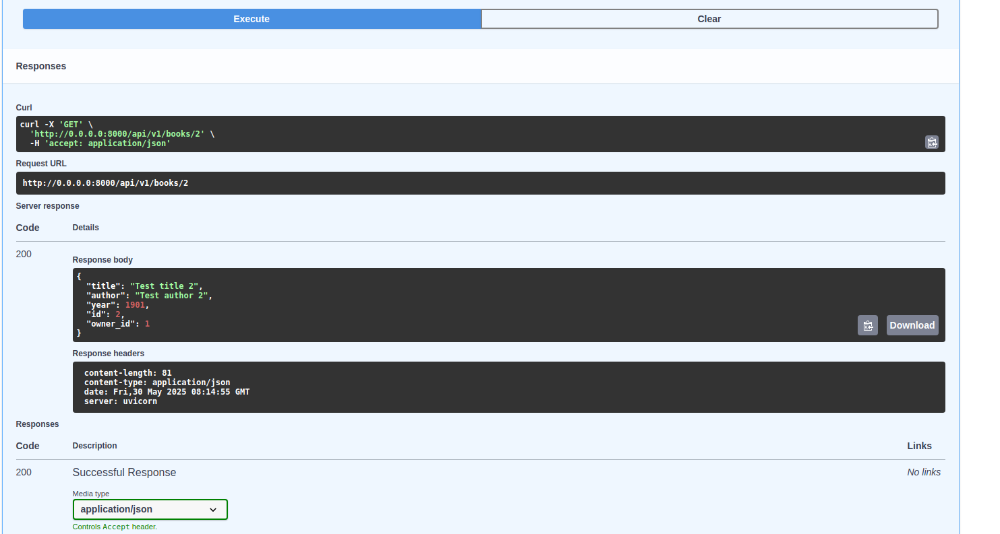

# DELETE FOR AUTH

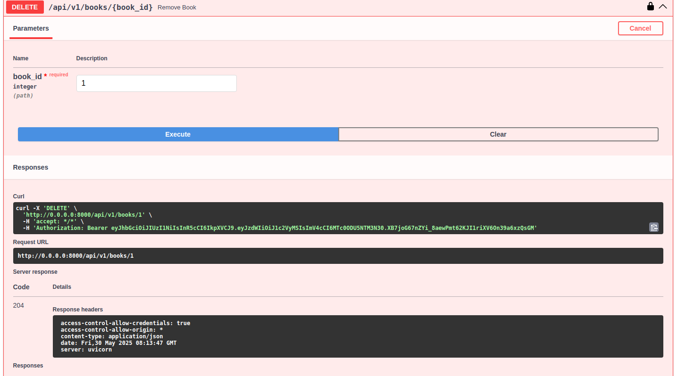